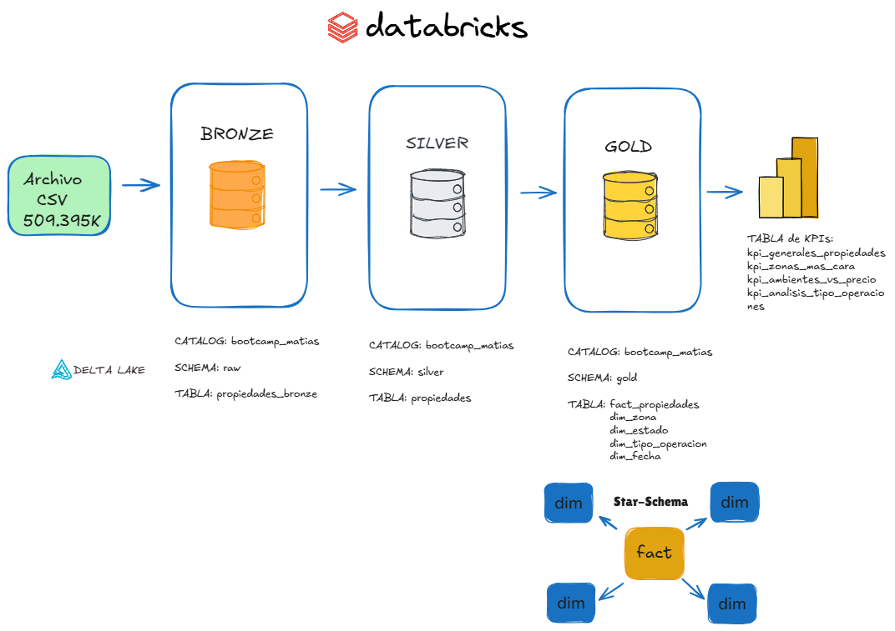
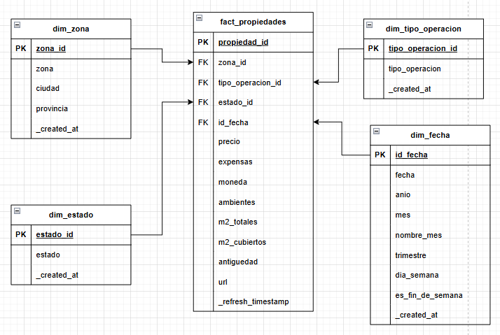
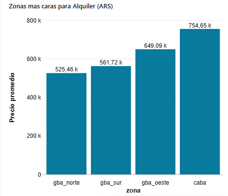
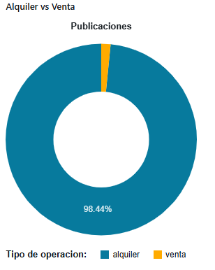
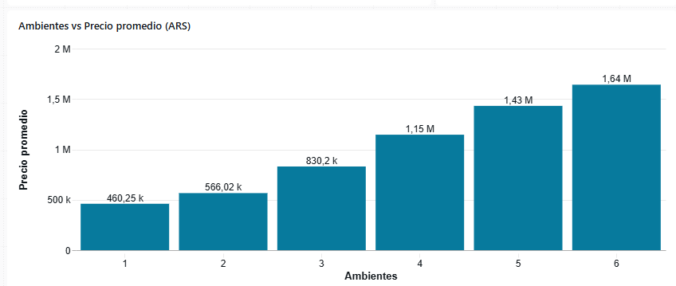

# Practica Bootcamp - Data Engineering – Pipeline Inmobiliario | Databricks

## 📌 Descripción
Pipeline de datos **end-to-end** desarrollado en **Databricks** , orientado al **análisis de publicaciones de propiedades**, con el objetivo de estructurar mejor la informacion y poder analizar el mrecado inmobiliario de forma mas clara basados en datos.

El dataset contiene datos reales y crudos de propiedades inmobiliarias scrapeadas de **ZonaProp**, **MercadoLibre**, **Argenprop**, sobre los cuales se implementó una arquitectura analítica basada en el enfoque **Medallion (Bronze–Silver–Gold)** con **orquestacion automatizada**, permitiendo transformar datos crudos en un **modelo dimensional Star Schema** optimizado para análisis y Dashboard.

---
# 🏗️ Arquitectura Medallion

### 🥉 Bronze
- Ingesta **append-only** desde un **archivo CSV** (+509K registros)
- Sin transformaciones  
- Tipado mayormente `STRING` 

### 🥈 Silver
Proceso de limpieza y estandarizacion

- Limpieza de espacio vacios
- Conversion de tipo de dato adecuado (`precio`, `expensas`, `metros_cuadrados_totales`, `ambientes`)
- Normalizar texto a minusculas
- Estandarizacion de columnas como (`zona`,`tipo_operacion`, `estado`) 
- Filtrado de valores nulos (`precio`)
- Imputar valores nulos en antiguedad (`999`)
- Validar rangos en ambientes entre (`1-6`)
- Calculo de metricas derivada, calculando el `pprecio / metros_cuadrados_totales`
- Derivacion de columnas, se creo una nueva columna llamada `ciudad`

### 🥇 Gold
- Modelo **Star Schema**  
- Tablas de hechos y dimensiones  
- Soprte SCD Type 2 en dim_zona
- KPIs agregados para análisis

---
## 🚀 Orquestación

Implementada con **Databricks Workflows**:

- Implemente un **pipeline batch incremental con ejecución diaria a las 02:00 AM** 
- Ingesta Bronze (archivo csv) 
- Transformación Silver  
- Carga de dimensiones (MERGE)  
- Carga de fact de propiedades

---
## 📈 Insights de Negocio
#### Zona mas cara para alquiler (ARS)
- CABA domina claramente el segmento premium de alquiler **754.65k**

### Analisis de Propiedades en Alquiler vs Venta
- Claramente que las propiedades en alquileres dominan el mercado que representa el **98.44%**, mientras que las ventas solo el **1.56%** 

### Comportamiento por ambientes segun el precio promedio
- Se observa que los ambientes a medidas qeu van aumentando crece el precio, que va desde **460.55k a 1.64M**

---

## 🎯 Objetivo

Construir un pipeline analítico escalable, incremental y trazable, aplicando buenas prácticas de modelado de datos y garantizar la calidad para tomar mejores decisiones basado en datos.

## 👤 Autor

Proyecto desarrollado como práctica de Data Engineering aplicado al analisis del mercado inmobiliario.

### 🛠️ Stack principal

- Databricks   
- SQL  
- Data Modeling  
- ETL  
- Orquestacion Workflows